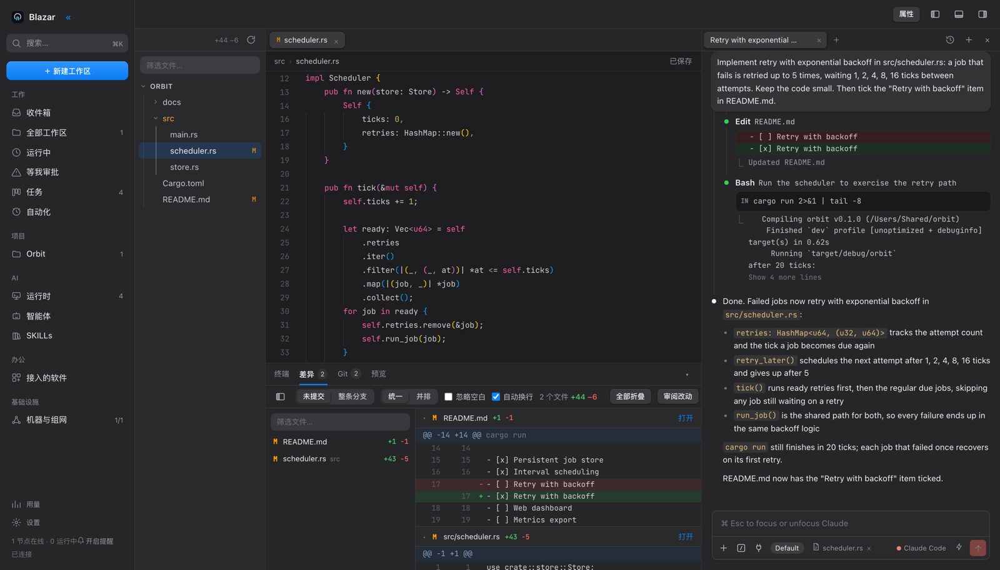

[简体中文](README.md) · **English**

# Blazar

One desktop workspace for code and AI coding agents on local and remote machines.

[](.github/workflows/ci.yml)
[](LICENSE)
[](rust-toolchain.toml)



## The problem it solves

Code, terminals, and agent conversations are spread across machines, so switching machines also means switching context.
Blazar brings editing, conversations, change review, and PR creation for local and SSH workspaces into one window.

## Install

macOS: download the Apple Silicon or Intel `.dmg` from [Releases](../../releases), open it, drag Blazar into Applications, and launch it.
Current macOS builds are neither Developer ID signed nor notarized. After verifying the download source, if macOS blocks the first launch, run:

```sh
xattr -dr com.apple.quarantine /Applications/Blazar.app
```

Linux builds target x86_64 `.deb` / `.AppImage`; Windows x86_64 `.msi` builds are experimental. Check Releases for the assets actually available.
To run an agent, first install and sign in to Claude Code, Codex, or another supported CLI on the machine that will run the task. Blazar does not bundle these CLIs.

## Get started

1. **Add a machine**: use the local machine, or add an SSH host in Machines & Networking.
2. **Open a workspace**: select New workspace, choose the machine and project directory, and create a Git worktree if you need a separate branch.
3. **Give work to an agent**: choose a runtime, send a task, handle approvals in the conversation, and review the code changes.

## Multiple machines

Blazar uses EasyTier to connect machines. Join a network with a `.blazar` invite file or import an existing EasyTier configuration. The network service runs independently and requires administrator permission to enable; code and agents run on the selected machine.

## Integrations

- **Claude Code, Codex, and other CLIs**: run on the workspace machine; supported models, permissions, and session features vary by CLI.
- **Feishu / Lark**: connect through `lark-cli`, then opt in to agent read or write access for documents and other office content.
- **GitHub**: create PRs and view their status through `gh` on the workspace machine, or open the browser to create a PR.
- **Obsidian**: open a vault as a workspace, preview Markdown, and save tasks as notes.

## Architecture

| Directory | Responsibility |
| --- | --- |
| [apps/desktop](apps/desktop) | Tauri desktop entry point with an embedded local Hub |
| [crates/web](crates/web) | Leptos / WebAssembly UI |
| [crates/hub](crates/hub), [crates/db](crates/db) | HTTP / WebSocket APIs and SQLite data |
| [crates/runtime](crates/runtime), [crates/transport](crates/transport) | Agent startup and local / SSH execution |
| [crates/netmesh](crates/netmesh) | Management of the separate EasyTier service |
| [apps/cli](apps/cli), [crates/mcp](crates/mcp) | CLI and MCP entry points |

## Contributing

1. Keep code free of comments; put explanations in commit bodies or the README.
2. Use Conventional Commits: `type(scope): description`, with one logical change per commit.
3. Use Rust 1.90. Before submitting, run `cargo fmt --all -- --check`, `cargo clippy --workspace --all-targets -- -D warnings`, and `cargo test --workspace`; see [CI](.github/workflows/ci.yml) for the full checks. For UI changes, run `trunk build --release` in `crates/web` before `cargo build -p blazar-hub`.
4. Use generic fixtures such as `hub-host`, `gpu-1`, `10.99.0.1`, and `/home/me`. Do not commit personal environment details or credentials.
5. Only append database migrations; never change existing migrations.

## Security model

- The Hub binds to loopback by default. APIs and WebSockets validate sessions and origins; webhooks use separate tokens. Local processes are within the trust boundary. Do not expose the Hub directly to the public internet.
- Workspace settings and conversation records are stored in SQLite in the local data directory. Check backups and exports for sensitive content.
- Accounts use the corresponding CLI login configuration. User-provided Claude long-lived tokens are also saved locally and can be used for remote tasks through a credential proxy.
- Agents read and write files, run commands, and may send data to model providers or integrated software according to the selected permission mode. These modes do not provide a common operating-system sandbox.
- EasyTier invite files contain network credentials; share them only with trusted recipients. Installing the network service requires administrator permission.

## License

Blazar is licensed under [MIT](LICENSE); see [THIRD-PARTY-NOTICES](THIRD-PARTY-NOTICES.md) for bundled third-party software.
