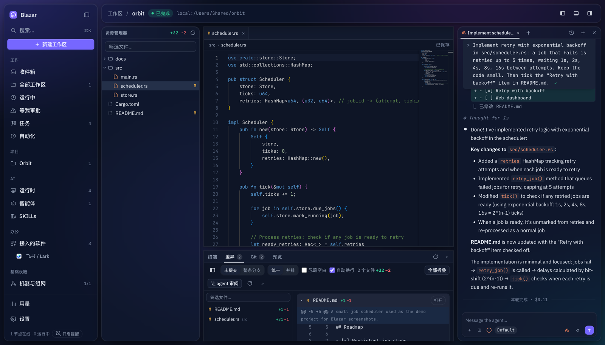
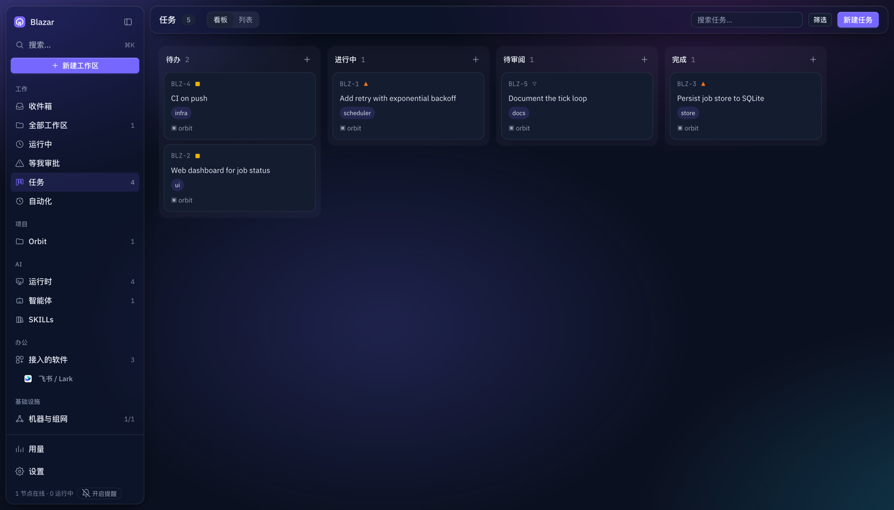
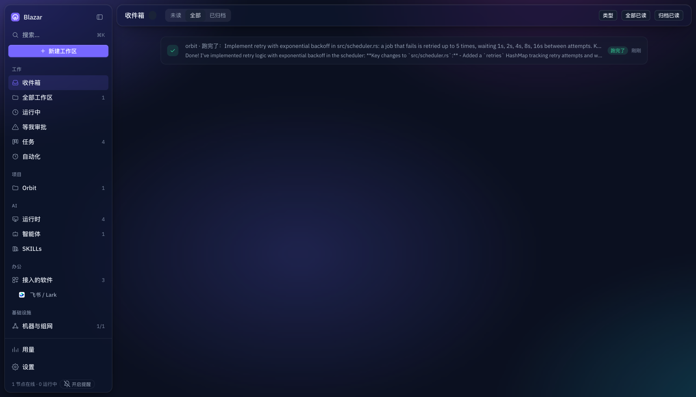
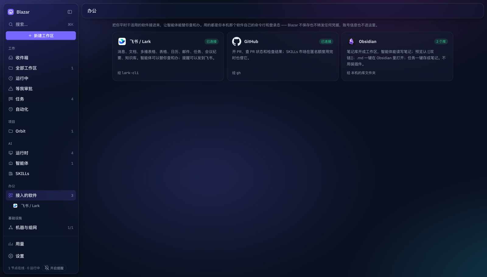
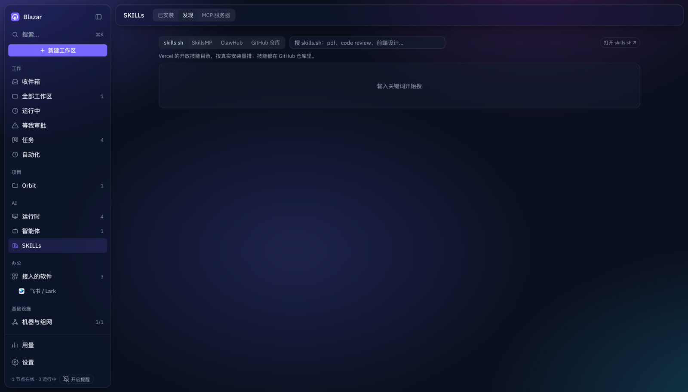
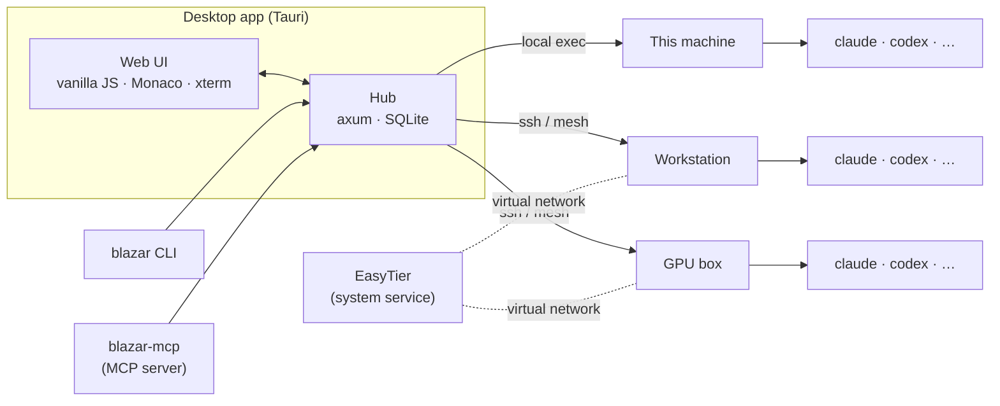

<div align="center">


# Blazar

**One desk for every machine your agents work on.**

Blazar is an open-source desktop app that turns the machines you already have — a laptop, a
workstation, a few GPU boxes, a cloud VM — into one workspace for AI coding agents. Browse and
edit code on any of them, hand work to Claude Code, Codex and friends, review the diff, open the
PR, and get pinged only when a human is needed. Machines find each other over a peer-to-peer
mesh, so nothing has to be reachable from the internet.

[](.github/workflows/ci.yml)
[](LICENSE)
[](rust-toolchain.toml)

[Get started](#get-started) · [Networking](#networking) · [Integrations](#integrations) · [CLI & MCP](#cli-and-mcp-server) · [Architecture](#architecture) · [Contributing](#contributing) · [Security](#security)

**English** · [简体中文](README.zh.md) · the app UI is currently in Chinese

</div>

<p align="center">
  
</p>

---

## What is Blazar?

You have more than one computer, and the agents you use live in terminal tabs on each of them.
Context is spread across machines, every hand-off is a copy-paste, and the only way to know what
an agent did on the GPU box is to ssh in and look.

Blazar puts all of it behind one window. A *workspace* is a directory on any machine in your
fleet. Open it and you get the file tree, a real editor, Markdown preview, a terminal, the git
diff, and a conversation with whichever agent CLI is installed there — the same view whether the
directory is local or three hops away. Agents run where the code is; Blazar never ships your
files anywhere.

---

## Work with agents

*Claude Code, Codex, Copilot, OpenCode, Qwen, Gemini — whatever is installed on that machine.*

- **Conversations that look like the terminal →** Tool calls, diffs, thinking and questions are rendered the way Claude Code shows them, with a queue, edit-and-retry, and answer cards for the questions an agent asks back.
- **Review loop →** Comment on the diff, send the comments back to the agent, watch the next round land. Nothing merges until you say so.
- **Git panel →** Commit, rebase, push, and open a pull request from the workspace — with AI-drafted titles and descriptions.
- **Tasks →** A board of work items. Assign one to an agent and it starts on the workspace it belongs to.
- **Autopilots →** Cron-scheduled or webhook-triggered runs: nightly audits, weekly reports, "fix the flaky test" every morning. Three consecutive failures pause an autopilot.
- **Inbox and attention queue →** Approvals, questions, failures and finished runs in one list; desktop badge and sounds only for the kinds you choose. Rules auto-approve the boring ones.
- **SKILLs →** A library of agent skills, importable from `~/.claude/skills`, discoverable from skills.sh, SkillsMP, ClawHub and GitHub, attachable per agent — plus MCP servers with write-only secrets.

<p align="center">
  
  
</p>

## Work across machines

*Your fleet, discovered automatically.*

- **Peer-to-peer mesh →** Blazar bundles [EasyTier](https://github.com/EasyTier/EasyTier) as a system service. Machines behind NAT find each other, hole-punch when they can, relay when they can't.
- **Invites, not shared secrets →** Each teammate gets a `.blazar` file with their own revocable credential. Double-click it to join.
- **Bring your own config →** Already running EasyTier? Import its `config.toml` and keep the subnet proxies, port forwards and exit nodes you rely on.
- **Any directory, any machine →** Remote file tree, editor, search, terminal and diff over SSH with the same latency-aware UI.
- **Health and profile per node →** CPU, memory, GPU, which agent CLIs are installed and signed in, whether the box can reach the model APIs.

## Work with your other tools

- **Feishu / Lark →** Through the official `lark-cli`: agents can read and write docs, tables, calendars and messages (opt-in, read-only or read-write), notifications forward to a chat, and a task becomes a document in one click. Install, create the app and log in from inside Blazar.
- **GitHub →** Through `gh`: pull requests, PR status, and a fallback for the skills marketplace.
- **Obsidian →** A vault is just a folder: open it as a workspace, `[[wikilinks]]` resolve in the preview, notes open in Obsidian, tasks save as notes.

<p align="center">
  
  
</p>

## Stay in control

- **Credentials stay where they are →** Blazar drives the CLIs you have already authenticated. It never stores or forwards a token, and it only checks whether a credential exists — it never reads one.
- **Permission modes per run →** From "ask for everything" to "bypass", plus auto-approval rules with an explicit denylist for shell metacharacters.
- **Local data →** One SQLite file. No accounts, no telemetry, no server to run.
- **Scriptable →** The `blazar` CLI and an MCP server expose everything the UI can do, so agents can drive Blazar too.

---

## Get started

**Prerequisites:** a machine with at least one supported agent CLI installed and signed in
(Claude Code, Codex, …). Blazar drives them; it does not ship them.

### Download

Every tagged version is built by GitHub Actions and published on the
[Releases](https://github.com/6B6BCraigYoung/blazar/releases) page: macOS (`.dmg`, Apple Silicon
and Intel), Linux (`.deb`, `.AppImage`), Windows (`.msi`, experimental and untested), plus a
tarball with the `blazar` CLI, `blazar-hub` and `blazar-mcp` binaries. Or build from source below.

The macOS builds are not notarized, so a copy downloaded with a browser is quarantined and
macOS reports it as "damaged" (right-click → Open does not help). Drag Blazar.app to
Applications, eject the disk image, then clear the quarantine flag once:

```bash
xattr -dr com.apple.quarantine /Applications/Blazar.app
```

Downloads made with `curl` are not quarantined, so this also works without the extra step:

```bash
curl -L -o Blazar.dmg https://github.com/6B6BCraigYoung/blazar/releases/latest/download/Blazar_0.1.0_aarch64.dmg
```

### Build from source

```bash
git clone <your fork>/blazar.git && cd blazar
scripts/fetch-easytier.sh          # downloads the mesh engine binary, verifies its SHA-256
cargo build --release              # hub, CLI, MCP server
scripts/package-macos.sh           # desktop app (.app + .dmg) on macOS
```

Requires Rust 1.90+, and on Linux the [Tauri prerequisites](https://tauri.app/start/prerequisites/).
The hub also runs on its own, without the desktop shell:

```bash
./target/release/blazar-hub --bind 127.0.0.1:7777      # then open http://127.0.0.1:7777
```

Data lives in one SQLite file under the platform data directory (`~/Library/Application Support/ai.blazar.Blazar`
on macOS); `--db` or `BLAZAR_DB` picks another file.

### First five minutes

1. **Open Blazar.** It starts an embedded hub on `127.0.0.1:61528` and shows the machine it runs on.
2. **Add a workspace.** `New workspace`, pick a machine — `local`, any `Host` from `~/.ssh/config`, or a mesh node — and browse to a directory; git repositories are marked.
3. **Talk to an agent.** The composer lists the agent CLIs found on that machine; model and permission mode are per conversation. Ask for something, watch the transcript, review the diff, leave comments and send them back, or commit from the Git panel.
4. **Connect a second machine.** Open *Machines & mesh*, configure an issuer (a node that holds the network secret), generate an invite, and double-click the `.blazar` file on the other computer.

---

## Runtimes

Blazar does not ship a model. It discovers the agent CLIs installed on each machine and drives
them through their own streaming protocols, normalising everything into one transcript model.

| Agent | CLI | Agent | CLI |
| --- | --- | --- | --- |
| Claude Code | `claude` | OpenAI Codex | `codex` |
| GitHub Copilot CLI | `copilot` | OpenCode | `opencode` |
| Qwen Code | `qwen` | Gemini CLI | `gemini` |
| Grok Build | `grok` | DeepSeek dsh | `dsh` |
| Deep Code | `deepcode` | | |

Claude Code gets the deepest integration (native resume, thinking display, skills directory,
MCP config, permission decisions); the others share a generic CLI runtime.

---

## Networking

Blazar connects machines with [EasyTier](https://github.com/EasyTier/EasyTier), a peer-to-peer
mesh VPN: every node gets a virtual IPv4 address, traffic is encrypted, hole-punched when
possible and relayed otherwise.

**How it is bundled.** `scripts/fetch-easytier.sh` downloads the official release binaries,
verifies pinned SHA-256 sums, and the desktop app ships them unmodified. The engine runs as a
separate process installed as a system service (launchd, systemd or a Windows service), so a
machine stays on the mesh when the app is closed. Creating the virtual interface needs
administrator rights, so installing or removing the service prompts once; status queries use the
engine's local RPC and need none. EasyTier is LGPL-3.0 and is never linked into Blazar — see
[THIRD-PARTY-NOTICES.md](THIRD-PARTY-NOTICES.md).

**Roles.** An *issuer* is a node that holds the network secret, typically the relay. Blazar
reaches it over SSH (or locally) and runs `easytier-cli credential` there to issue and revoke
credentials; configure it under *Machines & mesh → Invite → Issuer settings*. Without an issuer
you can still join networks; you just cannot invite others.

**Invites.** A `.blazar` file holds one person's credential: an X25519 private key signed by the
issuer, the network name, entry points and an optional fixed address. It is revocable, expires,
and is not reusable, so a forwarded copy cannot coexist with the original. Opening the file
(double-click, drag onto the Dock icon, or *Join with an invite*) installs the engine and joins;
`blazar join <file>` does the same on servers without a desktop. Treat the file like a password.

**Existing configurations.** *Import EasyTier config* accepts a standard `config.toml`. Top-level
keys are validated against EasyTier 2.6's schema so a typo does not silently disable a feature,
and the file is written with root-only permissions before the service loads it. Subnet proxies,
port forwards, exit nodes and ACLs pass through.

**Topology.** The node list comes from the issuer when one is configured, otherwise from the
local engine or the RPC of an EasyTier instance you already run. Each node shows its latency,
whether the path is direct or relayed, and the workspaces on it.

---

## Integrations

Integrations live under *Apps* in the sidebar. All of them use the tool's own command line and
the login state that already exists on this machine; Blazar does not store or forward
credentials, and account details never reach the UI.

**Feishu / Lark** — backed by the official [`lark-cli`](https://www.npmjs.com/package/@larksuite/cli).
The connect wizard installs `lark-cli`, creates a Feishu app and logs in without leaving Blazar;
steps that need you open in the browser and tokens go to the system keychain via `lark-cli`
itself. Binding an *existing* app needs an app secret, which Blazar deliberately does not accept.
Agent access is off by default; *read-only* lets agents query, *read-write* lets them send
messages, create documents and change calendars. Every command is classified by its own `--help`
risk level; high-risk writes and anything touching login or configuration are never allowed, and
calls are logged with the command path only. Inbox kinds you choose can be forwarded to a chat,
and a task can be saved as a Feishu document.

**GitHub** — backed by `gh`: pull requests from the Git panel, PR status and checks, and an
authenticated fallback for the skills marketplace. Only the exit code of `gh auth status` is
read.

**Obsidian** — a vault is a folder of Markdown, so no plugin or API is involved. Vaults come
from Obsidian's own registry; Blazar counts files and never reads notes. Open a vault as a
workspace and agents can read and write notes under the usual permission modes; the preview
renders `[[wikilinks]]`, `[[note|alias]]`, `[[note#heading]]`, `![[image.png]]` and
`==highlight==`; notes open in Obsidian from the editor toolbar; a task becomes a note with
front matter in the folder you choose.

**Adding one.** Add an entry to `OFFICE_APPS`, `APP_LOGO`, `officeState`, `loadOffice` and the
`pageApp` dispatch table in `crates/hub/static/js/office.js`, and a status endpoint in a module
under `crates/hub/src/office/`. Use the product's own icon.

---

## CLI and MCP server

Both talk to a running hub; set `BLAZAR_HUB` (default `http://127.0.0.1:61528`, the desktop
app's embedded hub).

```
blazar run --host <node> --cwd <path> "<prompt>"    start a conversation and stream it
blazar prompt <workspace> "<text>" [--wait --until idle|blocked --timeout <s>]
blazar wait <workspace> [--until idle|blocked]       exit 0 idle, 2 stalled, 3 timeout
blazar replay <session-id>                           replay a stored transcript
blazar task list | create | start
blazar autopilot list | run
blazar tree <node> <path>        blazar search <node> <path> <query>
blazar worktree <node> <path> create "<name>"
blazar agents <node>             blazar health <node>
blazar mesh [--via <host> --container <name>]
blazar join <invite.blazar> | leave | mesh-status
```

`blazar-mcp` is an MCP server so agents can drive Blazar. For Claude Code:

```json
{ "mcpServers": { "blazar": {
    "command": "/path/to/blazar-mcp",
    "args": ["--hub", "http://127.0.0.1:61528"] } } }
```

Tools: `list_workspaces`, `list_nodes`, `discover_agents`, `probe_node`, `create_workspace`,
`read_file`, `list_files`, `search_code`, `get_diff`, `send_prompt`, `get_history`,
`list_tasks`, `get_task`, `create_task`, `update_task`, `start_task`, `wait_workspace`,
`list_autopilots`, `run_autopilot`, `list_inbox`, `get_analytics`, `get_usage`.

The UI, CLI and MCP server all use the JSON API under `/api/`. Requests must come from the same
origin or from a loopback client without an `Origin` header; routes are declared in
`crates/hub/src/lib.rs`.

---

## Architecture



| Layer | Stack |
| --- | --- |
| Desktop | Tauri 2, embedding the hub in-process |
| UI | Single-page vanilla JavaScript, Monaco, xterm.js — no build step |
| Hub | Rust, axum, SQLite (sqlx migrations), WebSocket event bus |
| Transports | Local exec, SSH, mesh (virtual IPs from EasyTier) |
| Agent runtimes | Streaming protocols of each CLI, normalised into one transcript model |
| Networking | Unmodified EasyTier binary as a system service, managed by Blazar |

```
apps/
  desktop/      Tauri shell: window, file associations, Dock badge, bundled mesh engine
  cli/          `blazar` command line
crates/
  hub/          axum server: HTTP + WebSocket API, SQLite, the web UI under static/
    src/api/    HTTP handlers by area      src/agent/   profiles, runs, chat queue, checkpoints
    src/work/   tasks, autopilots, inbox   src/skills/  library and marketplace
    src/office/ settings, Feishu, Obsidian src/mesh.rs  status, issuer, invites
  runtime/      agent CLIs and their stream protocols
  transport/    local exec or SSH          vfs/         remote file tree, read/write, search, diff
  netmesh/      EasyTier management        worktree/    git worktrees for isolated runs
  terminal/     PTY sessions               mcp/         `blazar-mcp`
  db/           migrations and connections core-types/  identifiers and the transcript model
```

State changes are published on a broadcast bus and pushed to the UI over one WebSocket per
client. Everything that touches a machine goes through `blazar_transport::NodeTransport`; the
remote file system batches operations into single round trips so latency stays tolerable on
distant hosts. The UI under `crates/hub/static/` is embedded into the hub binary: one HTML file,
one stylesheet and classic scripts loaded in order, with Monaco and xterm.js vendored so the app
works offline.

---

## Contributing

```bash
cargo run -p blazar-hub -- --bind 127.0.0.1:7777      # http://127.0.0.1:7777
cargo test --workspace
cargo fmt --all && cargo clippy --workspace --all-targets -- -D warnings
```

Rust 1.90 is pinned in `rust-toolchain.toml`. The web UI needs a rebuild of `blazar-hub` after
each change; there is no bundler and no framework — keep it that way unless a change genuinely
needs one.

Ground rules:

- **No comments in code.** Names and structure carry the meaning; explanations go in this README or the pull request.
- **Credentials never pass through Blazar.** Integrations call the user's own CLI with the login state already on the machine. Only check that a credential *exists*.
- **Nothing environment-specific in the tree.** Hostnames, addresses, network names and account names in tests, fixtures, placeholders and docs must be examples (`hub-host`, `gpu-1`, `10.99.0.0/24`, `203.0.113.10`).
- **Migrations are append-only.** Add a file under `crates/db/migrations/`; do not rewrite an applied one.
- **Remote work goes through a transport**, and user-provided text is passed on stdin or shell-quoted.
- **Product icons only** for integrations (`crates/hub/static/vendor/brands/`).

Pull requests: one topic each; fmt, clippy (`-D warnings`) and tests must pass; add a unit test
for logic that can be tested without a machine and say what you verified by hand for the rest;
UI changes come with a 1600 px screenshot and a note on whether they were checked in the packaged
app or only in a browser. Commit messages follow [Conventional Commits](https://www.conventionalcommits.org/en/v1.0.0/).
The app icon is regenerated from `apps/desktop/icons/src/blazar-brand.svg`
with `node scripts/render-icon.mjs <svg> icon-1024.png 1024` followed by `cargo tauri icon`.

**Releasing.** Bump `version` in `Cargo.toml` (`[workspace.package]`) and
`apps/desktop/tauri.conf.json`, commit, then push a tag with the same number:
`git tag v0.2.0 && git push origin v0.2.0`. The `release` workflow builds every platform and
opens a **draft** release; review the notes and assets on the Releases page, then publish.

---

## Security

Report vulnerabilities privately through the repository's security advisory page rather than in
a public issue; include steps to reproduce and the commit you tested. Only the latest release
receives fixes.

The model: the hub listens on loopback only and rejects cross-origin requests, and has no
authentication of its own. Credentials are never stored, read or forwarded. Agents run with the
permission mode you choose; auto-approval rules refuse shell metacharacters and approvals are
logged. Integrations are opt-in per capability. The mesh engine runs as root because it creates a
network interface; it is the unmodified upstream binary, verified at download, installed into a
root-owned directory, with its configuration written root-only — Blazar itself never runs as
root. Invite files are bearer credentials and can be revoked from the issuer.

---

## License

[MIT](LICENSE). Third-party components bundled with Blazar are listed in
[THIRD-PARTY-NOTICES.md](THIRD-PARTY-NOTICES.md).
