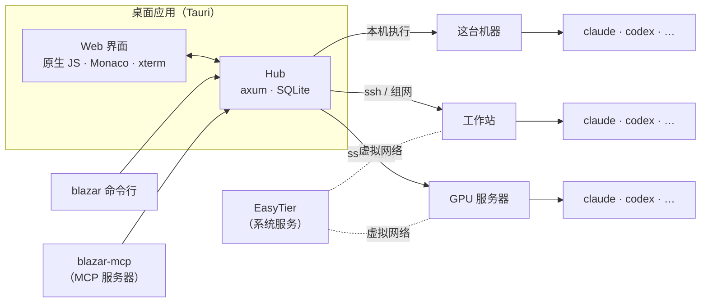

<div align="center">


# Blazar

**你所有机器上的智能体，一张桌面搞定。**

Blazar 是一个开源桌面应用，把你手头已有的机器——笔记本、工作站、几台 GPU 服务器、一台云主机——
变成 AI 编码智能体的同一个工作台。在任意一台机器上浏览和编辑代码，把活交给 Claude Code、Codex 等，
审阅差异、开 PR，只在需要人拍板的时候才被打扰。机器之间靠点对点组网互相发现，不需要任何一台能从公网访问。

[](.github/workflows/ci.yml)
[](LICENSE)
[](rust-toolchain.toml)

[上手](#上手) · [组网](#组网) · [接入的软件](#接入的软件) · [CLI 与 MCP](#cli-与-mcp-服务器) · [架构](#架构) · [参与贡献](#参与贡献) · [安全](#安全)

[English](README.md) · **简体中文**

</div>

<p align="center">
  
</p>

---

## Blazar 是什么？

你不止一台电脑，而智能体都活在各台电脑的终端标签页里。上下文散落在不同机器上，每次交接都是复制粘贴，
想知道 GPU 服务器上的智能体做了什么，只能 ssh 上去看。

Blazar 把这一切放进一个窗口。一个**工作区**就是你机群里任意一台机器上的一个目录。打开它，就有文件树、
真正的编辑器、Markdown 预览、终端、git 差异，以及和那台机器上装着的智能体命令行的对话——目录在本机还是在
三跳之外，看到的是同一个界面。智能体在代码所在的地方运行；Blazar 从不把你的文件搬到别处。

---

## 和智能体一起干活

*Claude Code、Codex、Copilot、OpenCode、Qwen、Gemini —— 那台机器上装了什么就用什么。*

- **像终端一样的对话 →** 工具调用、差异、思考和提问，照 Claude Code 的样子呈现；支持排队、编辑并重试，智能体反问时有回答卡片。
- **审阅回路 →** 在差异上留评论，一键发回给智能体，看下一轮改动落地。你不点头，什么都不会合并。
- **Git 面板 →** 在工作区里提交、变基、推送、开 PR，标题和描述可以让 AI 起草。
- **任务 →** 一块看板。把任务指派给智能体，它就在所属的工作区上开工。
- **自动化 →** 按 cron 或 webhook 触发的运行：每晚审计、每周报告、每天早上"修那个不稳定的测试"。连续失败三次自动暂停。
- **收件箱与注意力队列 →** 审批、提问、失败、完成汇在一处；桌面角标和提示音只给你选中的那几类。规则自动放行无聊的那些。
- **SKILLs →** 智能体技能库，可从 `~/.claude/skills` 导入，从 skills.sh、SkillsMP、ClawHub 和 GitHub 发现，按智能体挂载；MCP 服务器的密钥只写不读。

<p align="center">
  
  
</p>

## 跨机器干活

*你的机群，自动发现。*

- **点对点组网 →** Blazar 内置 [EasyTier](https://github.com/EasyTier/EasyTier)，装成系统服务。NAT 后面的机器互相找到，能打洞就直连，不能就中转。
- **邀请文件，而不是共享密钥 →** 每位同事拿到一份 `.blazar` 文件，里面是只属于 TA、可单独吊销的凭据。双击即加入。
- **自带配置也行 →** 已经在用 EasyTier？导入它的 `config.toml`，子网代理、端口转发、出口节点原样保留。
- **任意目录、任意机器 →** 经 SSH 的远程文件树、编辑器、搜索、终端和差异，界面对延迟有感知。
- **每台机器的体检和画像 →** CPU、内存、GPU，装了哪些智能体命令行、登没登录，能不能连到模型 API。

## 和你的其他工具一起干活

- **飞书 / Lark →** 经官方 `lark-cli`：智能体可以读写文档、多维表格、日历和消息（默认关闭，可选只读或读写），提醒转发到群聊，任务一键存成文档。安装、创建应用、登录都在 Blazar 里完成。
- **GitHub →** 经 `gh`：开 PR、查 PR 状态，技能市场的备用通道。
- **Obsidian →** 库就是一个文件夹：开成工作区，预览里 `[[双链]]` 可点，笔记在 Obsidian 里打开，任务存成笔记。

<p align="center">
  
  
</p>

## 一切在你掌控中

- **凭据留在原地 →** Blazar 只驱动你已经登录好的命令行。它从不存储或转发令牌，只检查凭据是否存在，绝不读取内容。
- **每次运行可选权限模式 →** 从"什么都问我"到"全部放行"，外加自动批准规则（明确拒绝 shell 元字符）。
- **数据在本地 →** 一个 SQLite 文件。没有账号，没有遥测，不用架服务器。
- **可脚本化 →** `blazar` 命令行和一个 MCP 服务器暴露了界面能做的一切，智能体也能驱动 Blazar。

---

## 上手

**前提：** 一台装好并登录了至少一个受支持智能体命令行（Claude Code、Codex……）的机器。Blazar 驱动它们，但不附带它们。

### 下载

每个打了标签的版本都由 GitHub Actions 构建并发布在 [Releases](https://github.com/6B6BCraigYoung/blazar/releases)
页面：macOS（`.dmg`，Apple Silicon 和 Intel）、Linux（`.deb`、`.AppImage`）、Windows（`.msi`，实验性、未经测试），
另有一个包含 `blazar` 命令行、`blazar-hub` 和 `blazar-mcp` 的压缩包。macOS 的包没有签名和公证：把 Blazar.app
拷进「应用程序」后执行一次 `xattr -dr com.apple.quarantine /Applications/Blazar.app`，或者右键应用选「打开」。
也可以按下面从源码构建。

### 从源码构建

```bash
git clone <your fork>/blazar.git && cd blazar
scripts/fetch-easytier.sh          # 下载组网引擎二进制，校验 SHA-256
cargo build --release              # hub、CLI、MCP 服务器
scripts/package-macos.sh           # macOS 上打桌面应用（.app + .dmg）
```

需要 Rust 1.90+；Linux 上还需要 [Tauri 的依赖](https://tauri.app/start/prerequisites/)。hub 也可以不带桌面壳单独跑：

```bash
./target/release/blazar-hub --bind 127.0.0.1:7777      # 然后打开 http://127.0.0.1:7777
```

数据是平台数据目录下的一个 SQLite 文件（macOS 是 `~/Library/Application Support/ai.blazar.Blazar`）；
`--db` 或 `BLAZAR_DB` 可以指定别的文件。

### 头五分钟

1. **打开 Blazar。** 它在 `127.0.0.1:61528` 起一个内嵌的 hub，显示它所在的这台机器。
2. **加一个工作区。** 点「新建工作区」，选机器——`local`、`~/.ssh/config` 里的任意 `Host`、或组网里的节点——浏览到目录，git 仓库会标出来。
3. **和智能体说话。** 输入栏列出那台机器上找到的智能体命令行，模型和权限模式按对话选。提需求，看转录，审差异，留评论发回去，或者从 Git 面板提交。
4. **接第二台机器。** 打开「机器与组网」，配置签发节点（持有网络密钥的那台），生成邀请，在另一台电脑上双击 `.blazar` 文件。

---

## 运行时

Blazar 不附带模型。它发现每台机器上装着的智能体命令行，通过它们各自的流式协议来驱动，归一成同一套转录模型。

| 智能体 | 命令 | 智能体 | 命令 |
| --- | --- | --- | --- |
| Claude Code | `claude` | OpenAI Codex | `codex` |
| GitHub Copilot CLI | `copilot` | OpenCode | `opencode` |
| Qwen Code | `qwen` | Gemini CLI | `gemini` |
| Grok Build | `grok` | DeepSeek dsh | `dsh` |
| Deep Code | `deepcode` | | |

Claude Code 的集成最深（原生续接、思考展示、技能目录、MCP 配置、权限决策）；其余走通用的命令行运行时。

---

## 组网

Blazar 用 [EasyTier](https://github.com/EasyTier/EasyTier) 把机器连起来——一个点对点的 mesh VPN：每个节点一个虚拟
IPv4 地址，流量加密，能打洞就直连，不能就中转。

**怎么打包的。** `scripts/fetch-easytier.sh` 下载上游官方发布的二进制，校验写死的 SHA-256，桌面应用原样带上。
引擎作为独立进程装成系统服务（launchd、systemd 或 Windows 服务），关掉应用机器也不掉线。建虚拟网卡需要管理员权限，
所以装服务、卸服务各弹一次授权；平时查状态走引擎的本机 RPC，不需要权限。EasyTier 是 LGPL-3.0，从不链接进 Blazar，
见 [THIRD-PARTY-NOTICES.md](THIRD-PARTY-NOTICES.md)。

**角色。** **签发节点**是持有网络密钥的那台，通常是中转节点。Blazar 经 SSH（或本机）在它上面执行
`easytier-cli credential` 来签发和吊销凭据；在「机器与组网 → 邀请同事 → 签发设置」里配置。没有签发节点也能加入别人的
网络，只是不能邀请别人。

**邀请。** 一份 `.blazar` 文件装着一个人的凭据：签发节点签过的 X25519 私钥、网络名、入网地址和可选的固定地址。
可吊销、会过期、不可复用，转发出去的副本没法和原件并存。打开文件（双击、拖到 Dock 图标、或「用邀请文件加入」）
就装引擎并入网；没有桌面的服务器用 `blazar join <file>`。把它当密码看待。

**已有配置。** 「导入 EasyTier 配置」接受标准的 `config.toml`。顶层键按 EasyTier 2.6 的结构校验，拼错不会静默失效；
文件以只有 root 可读写的权限落盘后再交给服务加载。子网代理、端口转发、出口节点、ACL 都能通过。

**拓扑。** 配置了签发节点就从它读节点列表，否则读本机引擎或你已经在跑的 EasyTier 的 RPC。每个节点显示延迟、直连还是中转、上面有哪些工作区。

---

## 接入的软件

接入的软件在侧栏「办公」板块。全部用那个软件自己的命令行和本机已有的登录态；Blazar 不存储也不转发凭据，账号信息不进界面。

**飞书 / Lark** —— 经官方 [`lark-cli`](https://www.npmjs.com/package/@larksuite/cli)。连接向导在 Blazar 里完成安装、创建飞书应用和登录；
需要你确认的步骤在浏览器里做，令牌由 `lark-cli` 自己存进系统钥匙串。绑定**已有**应用要填 App Secret，Blazar 有意不收这个。
智能体访问默认关闭；「只读」能查，「读写」能发消息、建文档、改日历。每条命令按它自己 `--help` 里的风险级别分类，
高风险写操作和登录、配置类命令永远不放行，调用只记命令路径。选中的收件箱类型可以转发到群聊，任务可以存成飞书文档。

**GitHub** —— 经 `gh`：Git 面板里开 PR、PR 状态和检查结果、技能市场匿名额度用完时的备用通道。只看 `gh auth status` 的退出码。

**Obsidian** —— 库就是一个 Markdown 文件夹，不涉及插件或接口。库的清单来自 Obsidian 自己的记录，Blazar 只数文件不读笔记。
把库开成工作区，智能体就能在通常的权限模式下读写笔记；预览渲染 `[[双链]]`、`[[笔记|别名]]`、`[[笔记#标题]]`、
`![[图片]]` 和 `==高亮==`；编辑器顶栏可在 Obsidian 里打开；任务可以存成带 front matter 的笔记，放进你指定的文件夹。

**再接一个。** 在 `crates/hub/static/js/office.js` 的 `OFFICE_APPS`、`APP_LOGO`、`officeState`、`loadOffice` 和 `pageApp`
分发表各加一项，在 `crates/hub/src/office/` 下加一个状态接口模块。用产品自己的图标。

---

## CLI 与 MCP 服务器

两者都连一个正在运行的 hub；用 `BLAZAR_HUB` 指定（默认 `http://127.0.0.1:61528`，即桌面应用内嵌的 hub）。

```
blazar run --host <node> --cwd <path> "<prompt>"    开一段对话并流式输出
blazar prompt <workspace> "<text>" [--wait --until idle|blocked --timeout <s>]
blazar wait <workspace> [--until idle|blocked]       退出码 0 空闲、2 卡住、3 超时
blazar replay <session-id>                           回放已落库的转录
blazar task list | create | start
blazar autopilot list | run
blazar tree <node> <path>        blazar search <node> <path> <query>
blazar worktree <node> <path> create "<name>"
blazar agents <node>             blazar health <node>
blazar mesh [--via <host> --container <name>]
blazar join <invite.blazar> | leave | mesh-status
```

`blazar-mcp` 是一个 MCP 服务器，让智能体也能驱动 Blazar。以 Claude Code 为例：

```json
{ "mcpServers": { "blazar": {
    "command": "/path/to/blazar-mcp",
    "args": ["--hub", "http://127.0.0.1:61528"] } } }
```

工具：`list_workspaces`、`list_nodes`、`discover_agents`、`probe_node`、`create_workspace`、`read_file`、`list_files`、
`search_code`、`get_diff`、`send_prompt`、`get_history`、`list_tasks`、`get_task`、`create_task`、`update_task`、
`start_task`、`wait_workspace`、`list_autopilots`、`run_autopilot`、`list_inbox`、`get_analytics`、`get_usage`。

界面、CLI 和 MCP 服务器用的都是 `/api/` 下的同一套 JSON 接口。请求必须同源，或者来自不带 `Origin` 头的回环客户端；
路由在 `crates/hub/src/lib.rs`。

---

## 架构



| 层 | 技术 |
| --- | --- |
| 桌面 | Tauri 2，hub 内嵌在同一进程 |
| 界面 | 单页原生 JavaScript、Monaco、xterm.js —— 没有构建步骤 |
| Hub | Rust、axum、SQLite（sqlx 迁移）、WebSocket 事件总线 |
| 传输 | 本机执行、SSH、组网（EasyTier 分配的虚拟 IP） |
| 智能体运行时 | 各命令行的流式协议，归一成同一套转录模型 |
| 组网 | 未改动的 EasyTier 二进制作为系统服务运行，由 Blazar 管理 |

```
apps/
  desktop/      Tauri 壳：窗口、文件关联、Dock 角标、内置的组网引擎
  cli/          `blazar` 命令行
crates/
  hub/          axum 服务：HTTP + WebSocket 接口、SQLite、static/ 下的网页界面
    src/api/    按领域分的 HTTP 处理器        src/agent/   智能体档案、运行、对话队列、检查点
    src/work/   任务、自动化、收件箱          src/skills/  技能库与市场
    src/office/ 设置、飞书、Obsidian          src/mesh.rs  组网状态、签发、邀请
  runtime/      智能体命令行及其流式协议
  transport/    本机执行或 SSH                vfs/         远程文件树、读写、搜索、差异
  netmesh/      EasyTier 管理                 worktree/    隔离运行用的 git worktree
  terminal/     PTY 会话                      mcp/         `blazar-mcp`
  db/           迁移与连接                    core-types/  标识符与转录模型
```

状态变化发布到一条广播总线，经每个客户端一条 WebSocket 推给界面。所有触碰机器的操作都经过
`blazar_transport::NodeTransport`；远程文件系统把操作合并成单次往返，远机器上延迟也能接受。
`crates/hub/static/` 下的界面编进 hub 二进制：一个 HTML、一个样式表、按顺序加载的普通脚本，Monaco 和 xterm.js 内置，离线可用。

---

## 参与贡献

```bash
cargo run -p blazar-hub -- --bind 127.0.0.1:7777      # http://127.0.0.1:7777
cargo test --workspace
cargo fmt --all && cargo clippy --workspace --all-targets -- -D warnings
```

Rust 1.90 钉在 `rust-toolchain.toml`。改了网页界面要重新构建 `blazar-hub`；没有打包器也没有框架——除非真的需要，别引入。

规矩：

- **代码里不写注释。** 靠命名和结构表达意图；解释写进这份 README 或 PR 描述。
- **凭据不经过 Blazar。** 接入的软件用用户自己的命令行和本机已有的登录态；只检查凭据*存不存在*。
- **仓库里不放任何环境相关的东西。** 测试、示例、占位符、文档里的主机名、地址、网络名、账号名一律用示例值（`hub-host`、`gpu-1`、`10.99.0.0/24`、`203.0.113.10`）。
- **迁移只追加。** 在 `crates/db/migrations/` 下加新文件，不改已应用的。
- **远程操作走传输层**，用户输入的文本走 stdin 或做 shell 转义。
- **接入的软件只用产品自己的图标**（`crates/hub/static/vendor/brands/`）。

PR：一个 PR 只做一件事；fmt、clippy（`-D warnings`）、测试必须通过；不依赖机器的逻辑补单元测试，其余的说明你手动验证了什么；
界面改动附 1600 像素宽的截图，并说明是在打包的应用里验证的还是只在浏览器里。提交说明遵循
[Conventional Commits](https://www.conventionalcommits.org/zh-hans/v1.0.0/)。应用图标从 `apps/desktop/icons/src/blazar-brand.svg`
用 `node scripts/render-icon.mjs <svg> icon-1024.png 1024` 出图，再 `cargo tauri icon` 生成全套。

**发版。** 把 `Cargo.toml`（`[workspace.package]`）和 `apps/desktop/tauri.conf.json` 里的 `version` 改成新号，提交，
然后推一个同号的标签：`git tag v0.2.0 && git push origin v0.2.0`。`release` 工作流会在各平台打包并创建一个**草稿** Release，
到 Releases 页面检查说明和附件后再发布。

---

## 安全

请通过仓库的安全公告页面私下报告漏洞，不要发公开 issue；附上复现步骤和测试的提交。只有最新版本会收到修复。

安全模型：hub 只监听回环地址并拒绝跨源请求，自身没有认证。凭据从不存储、读取或转发。智能体按你选的权限模式运行；
自动批准规则拒绝 shell 元字符，审批有记录。接入的软件按能力逐项开启。组网引擎以 root 运行（要建网卡），
用的是上游未改动的二进制，下载时校验，装进 root 专属目录，配置只有 root 可读写——Blazar 自己从不以 root 运行。
邀请文件是持有即可用的凭据，可在签发节点吊销。

---

## 许可证

[MIT](LICENSE)。随 Blazar 分发的第三方组件列在 [THIRD-PARTY-NOTICES.md](THIRD-PARTY-NOTICES.md)。
